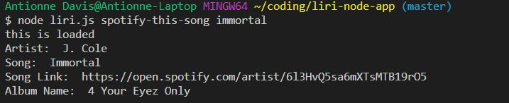

# liri-node-app

## Liri Bot Project
In this project, there are total of 4 command used to grab data from API listed below...
- Spotify
- OMDB
- Bands In Town
- random.txt (text file)
### The 4 Command Line used
1. spotify-this-song
2. movie-this
3. concert-this
4. do-what-it-says

## Testing LiriBot Project
### 1. cmd line: node liri.js spotify-this-song (name of song)

### 2. cmd line: node liri.js movie-this (name of movie)

### 3. cmd line: node liri.js concert-this (name of artist)

### 4. cmd line: node liri.js do-what-it-says 

